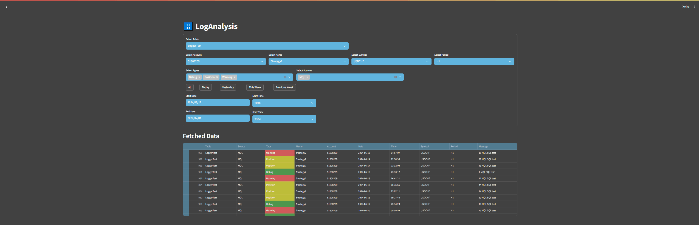

# Two side logger

## About the Project
If your running application uses several platforms, you may need to follow the process in parallel. Python is well known for its extensive data analysis capabilities and MQL is a widely used trading platform. In this project, I connected the logging methods of the two so that the processes can be followed at the same time. The display is done in Streamlit, and the data is stored in SQLite. Of course, you can connect any platform from which you can save data to SQL.

### The method is based on my previous libaries:

Python side: https://github.com/kisb-data/SQL-DataAccess

MQL side: https://github.com/kisb-data/MQL5-datatransfer-to-SQL

### Features:

 -Export your logs in different tables like Live, Demo or different strategies

 -Select based on account, name, symbol or period

 -3 different data typs: debug, position, warning (feel free to add what you wannt)

 -Select source, Python or MQL (these two are supported in this project)

 -Filter by date and time

 -If you have large massages or dont have wide monitor it is possible to reduce the size of messages, in this case it will show in info line
 
### Example:

## License

**Copyright 2024, kisb-data **  
kisbalazs.data@gmail.com 

## License

This code is free software: you can redistribute it and/or modify it under the terms of the GNU General Public License as published by the Free Software Foundation, either version 3 of the License, or (at your option) any later version.

This code is distributed in the hope that it will be useful, but WITHOUT ANY WARRANTY; without even the implied warranty of MERCHANTABILITY or FITNESS FOR A PARTICULAR PURPOSE. See the GNU General Public License for more details.

You should have received a copy of the GNU General Public License along with this code. If not, see <http://www.gnu.org/licenses/>.

### Additional Terms:

You may not use this software in products that are sold.

Redistribution and use in source and binary forms, with or without modification, are permitted provided that the following conditions are met:

1. **Redistributions of source code** must retain the above copyright notice, this list of conditions and the following disclaimer.

2. **Redistributions in binary form** must reproduce the above copyright notice, this list of conditions and the following disclaimer in the documentation and/or other materials provided with the distribution.

3. Neither the name of the copyright holder nor the names of its contributors may be used to endorse or promote products derived from this software without specific prior written permission.

4. **Products that include this software may not be sold.**

## Warranty Disclaimer

THE SOFTWARE IS PROVIDED "AS IS", WITHOUT WARRANTY OF ANY KIND, EXPRESS OR IMPLIED, INCLUDING BUT NOT LIMITED TO THE WARRANTIES OF MERCHANTABILITY, FITNESS FOR A PARTICULAR PURPOSE AND NONINFRINGEMENT. IN NO EVENT SHALL THE AUTHORS OR COPYRIGHT HOLDERS BE LIABLE FOR ANY CLAIM, DAMAGES OR OTHER LIABILITY, WHETHER IN AN ACTION OF CONTRACT, TORT OR OTHERWISE, ARISING FROM, OUT OF OR IN CONNECTION WITH THE SOFTWARE OR THE USE OR OTHER DEALINGS IN THE SOFTWARE.

---